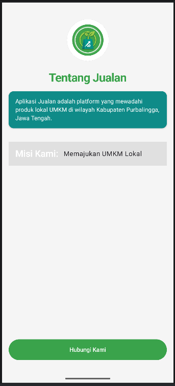
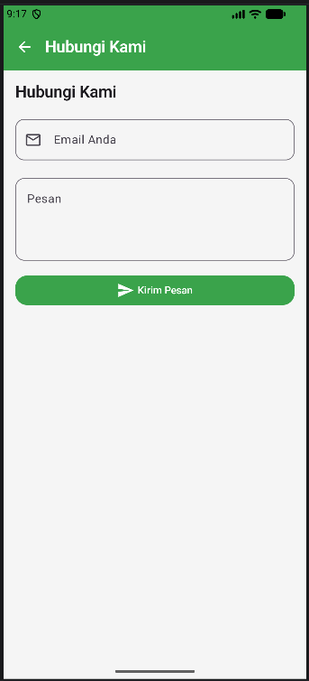

# Identitas Diri
- **Nama:** Jovita Fashya Islami
- **NIM:** H1D024125
- **Shift KRS:** Shift B
- **Shift Praktikum:** Shift I

## Hasil Praktikum 2

Pada praktikum 2 ini, saya mempelajari cara mengimplementasikan Material Design 3 dalam pengembangan aplikasi Android menggunakan Jetpack Compose. Saya membuat dua halaman utama, yaitu halaman **Tentang Jualan** yang menampilkan informasi aplikasi, dan halaman **Hubungi Kami** yang dilengkapi dengan form input berupa kolom email dan pesan. Selain itu, saya juga belajar menerapkan navigasi antar halaman menggunakan Navigation Compose, serta mengustomisasi tema warna dan tipografi sesuai panduan Material Design 3.
